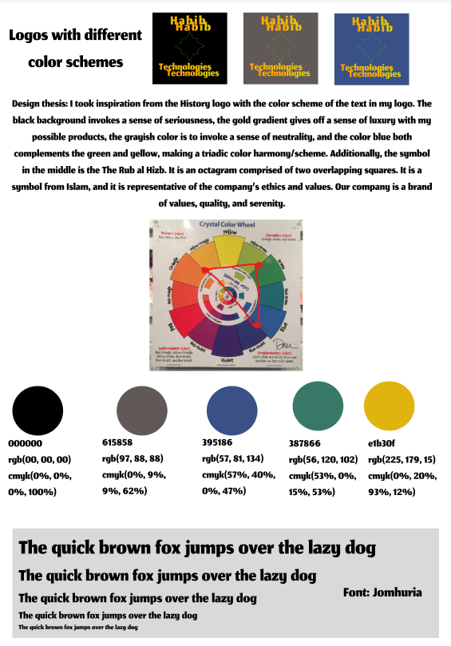
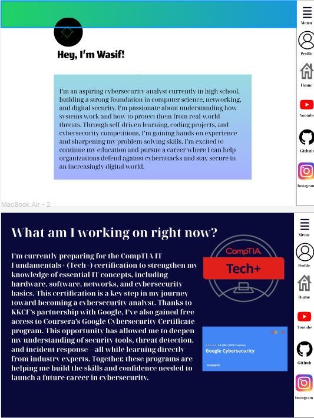

# Hi, I'm Wasif 🧑‍💻🖱️

 

I'm 17 and go to high school in the Bronx who is an aspiring cybersecurity analyst planning on majoring in MIS. I am also a writer for my school newspaper, [The Science Survey](https://thesciencesurvey.com/staff_name/wasif-habib/), and two of my articles have made it to the front page! I'm currently trying to build a strong foundation in computer science, networking, and digital security. I’m passionate about understanding how systems work and how to protect them from real-world threats. Through self-driven learning, coding projects, and cybersecurity competitions, I’m gaining hands-on experience and sharpening my problem-solving skills. I’m excited to continue my education and pursue a career where I can help organizations defend against cyberattacks and stay secure in an increasingly digital world. But at the same time, I'm currently stressing out about college essays 🥲

# My Experiences

🏥[Mount Sinai Hospital Volunteer 2024](https://mountsinai.vsyslive.com/)
🧑‍💻[KKCF Student 2025](https://www.theknowledgehouse.org/karim_kharbouch_coding_fellowship/)

# Here are my projects:

# Connect with me
[Replit](https://replit.com/@wasifbnx)
[GitHub](https://github.com/WasifH1)
